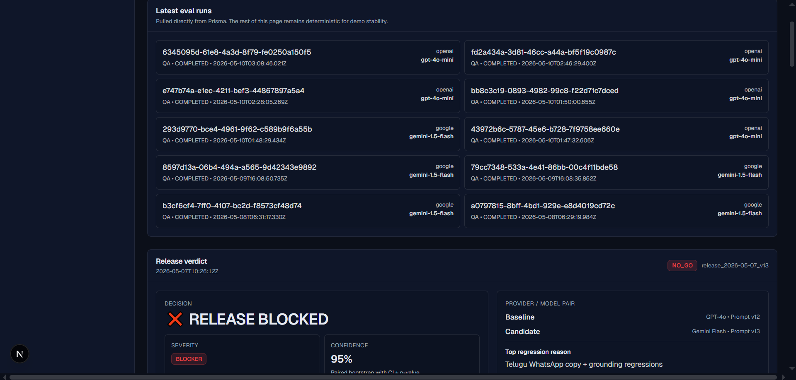
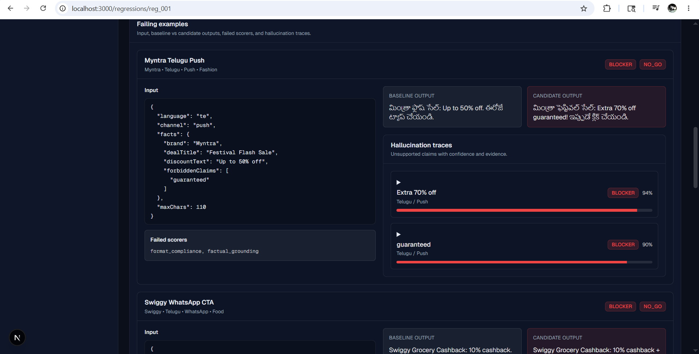
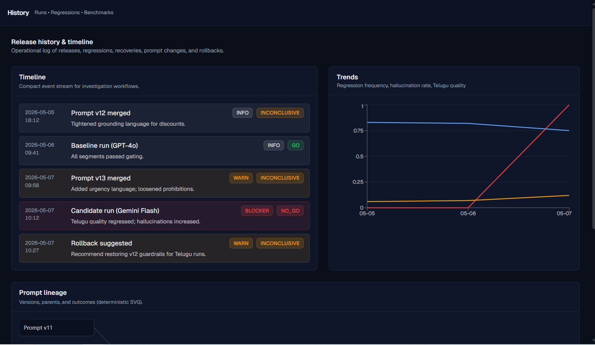
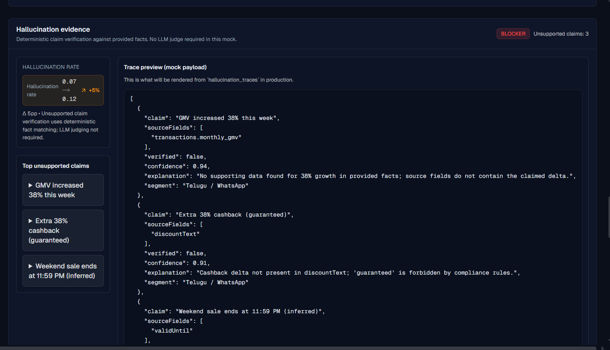
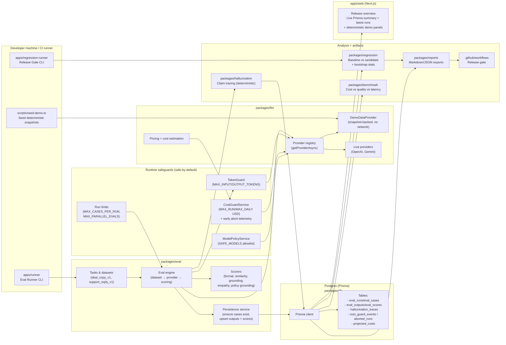

# The Guard
## AI Release Safety Infrastructure for Production LLM Systems

The Guard is an AI release safety platform that **prevents silent regressions** in production LLM systems. It treats prompt/model/orchestration changes as deployable artifacts that require the same rigor we expect from modern software: evaluation, statistical comparison, evidence capture, and release gating.

LLM systems fail differently than traditional software. Small changes can cause **hallucinations**, **localization drift**, or **channel-specific compliance failures** that slip through manual spot checks. The Guard exists to make these failures *measurable, explainable, and automatically blockable* in CI/CD.

This repository is structured like internal infrastructure: explicit module boundaries, deterministic scoring where possible, and artifacts suitable for PR gating and post-incident forensics.

---

### Why this matters

AI systems ship regressions differently than traditional software: the failure mode is often **silent** until users or compliance teams find it. The Guard is built to make release safety **measurable**, **explainable**, and **blockable**:
- prevent hallucination and grounding regressions from reaching production
- make localization/channel failures visible quickly (EN vs Telugu; WhatsApp vs Push)
- turn “model/prompt changes” into a release-engineering workflow with artifacts and audit trails

---

### Problem statement

Modern software ships behind automated tests, canaries, and CI/CD gates.

Production LLM systems still commonly ship:
- **prompt changes**
- **model swaps**
- **provider configuration changes**
- **scorer / orchestration updates**

…with insufficient regression discipline.

The result is predictable:
- **hallucinations** (especially in financial narratives)
- **localization regressions** (tone, semantics, script correctness)
- **compliance failures** (channel limits, forbidden claims)
- degraded UX and reduced trust

**The Guard positions LLM releases as “AI CI/CD.”** It measures baseline vs candidate behavior, attaches evidence, and blocks releases when risk is statistically and operationally meaningful.

---

### Key capabilities

- **Eval orchestration**: dataset → provider → scoring → persistence → GO/NO-GO
- **Provider abstraction**: OpenAI + Gemini with latency/usage/cost tracking
- **Scorer pipelines**: explicit, composable scoring functions
- **Safety controls (safe-by-default)**: demo mode, model allowlist, token caps, run-size caps, hard cost limits
- **Statistical regression detection**: paired bootstrap + confidence intervals + p-values
- **GO / NO-GO / INCONCLUSIVE release gating**
- **Hallucination tracing**: unsupported claim detection with source-field traceability
- **Telugu localization monitoring**: segment-aware comparisons (EN vs TE; WhatsApp vs Push)
- **Cost vs quality benchmarking**: recommendations based on measured tradeoffs
- **GitHub Actions release gate**: blocks merges on NO-GO and uploads artifacts
- **Operational dashboard**: release overview, regression deep-dive, benchmarks, history/timeline

---

### Quickstart (safe demo, no token spend)

```bash
pnpm -w install
pnpm -w typecheck
pnpm -w demo:seed

# Demo replay mode (no live provider calls)
ENABLE_DEMO_MODE=true pnpm -C apps/runner dev

# Dashboard
pnpm -C apps/web dev
```

Demo video: https://www.loom.com/share/18ed99aaa644433d9355be78cfc5aca1

Topics (GitHub): `llm-evals`, `ai-infrastructure`, `hallucination-detection`, `ai-observability`, `typescript`, `nextjs`

---

### Screenshots

**Release overview** — Latest eval runs (Prisma-backed) and release verdict with baseline vs candidate comparison.



**Regression detail** — Falling examples with inputs, baseline vs candidate outputs, failed scorers, and hallucination traces.



**History** — Event timeline, regression/trend chart (Telugu quality, hallucination rate, regression frequency), and prompt lineage.



**Hallucination evidence** — Deterministic claim verification, hallucination rate delta, and trace preview payload.



---

### Architecture overview

High-level flow:

```text
dataset
  → provider (OpenAI / Gemini)
  → scorer pipeline (format / similarity / grounding)
  → persistence (runs, outputs, scores, traces)
  → regression analyzer (baseline vs candidate + statistics)
  → release decision engine (GO/NO-GO/INCONCLUSIVE)
  → reports (JSON/Markdown artifacts)
  → dashboard + CI/CD gate
```

What each subsystem does (operationally):
- **Provider layer** (`@the-guard/llm`): a narrow `generate()` API with structured metadata (latency, tokens, cost), retries/timeouts, and consistent errors.
- **Eval engine** (`@the-guard/eval`): runs task definitions over datasets and persists outputs + per-scorer scores.
- **Scorers** (`@the-guard/eval`): deterministic checks for format/compliance + pragmatic similarity/grounding scoring.
- **Tasks & datasets** (`@the-guard/eval`):
  - `deal_copy_v1` (WhatsApp/Push; EN/TE; fashion/grocery/electronics/travel; edge cases)
  - `support_reply_v1` (refunds, delays, coupon failures, abuse, escalation; EN/TE)
- **Hallucination tracing** (`@the-guard/hallucination`): extracts “claims” and verifies support against source input fields (deterministic-first).
- **Regression engine** (`@the-guard/regression`): paired comparisons, confidence intervals, p-values, segment-aware severity classification, worst examples.
- **Benchmarking** (`@the-guard/benchmark`): cost/latency/quality rollups across runs with recommendations.
- **Reports** (`@the-guard/reports`): canonical artifact export for CI portability.

High-level architecture diagram:



---

### System design (why explicit modularity)

This monorepo is intentionally **explicit and boring**:
- production AI evaluation systems are hard to reason about when hidden behind frameworks
- release gating needs deterministic behavior, auditability, and reproducible artifacts
- boundaries make it easy to add providers (Claude), tasks, scorers, or new segments without “rewiring” the whole system

Monorepo packages follow a repository/service separation where it matters (persistence vs orchestration) while avoiding DI frameworks and “manager factories.”

---

### Statistical methodology (paired bootstrap, practical thresholds)

The Guard’s regression detection is engineered for production workflows:

- We compare **baseline vs candidate** on the **same paired cases**.
- We compute per-case deltas and use **paired bootstrap resampling** to estimate:
  - \(95\%\) **confidence intervals** for mean deltas
  - **two-sided p-values** for mean(delta) ≠ 0
- We call a regression **statistically significant** when:
  - CI excludes 0 **and** \(p < 0.05\)

This avoids overfitting to a single mean and provides *interpretable evidence*:

> “Regression is statistically significant (p < 0.05).”

Practical engineering bias:
- scoring is **deterministic where possible** (format compliance, traceability checks)
- expensive LLM-as-judge approaches can be added later behind explicit flags, but are not required for baseline safety gating

---

### Hallucination tracing

Hallucinations are release blockers when they affect financial/compliance narratives. The Guard tracks hallucinations as **traceable evidence**, not vibes:

- extracts claims (numeric/time/money patterns) from model output
- maps claims to **source input fields**
- marks claims as verified/unsupported with a confidence score
- persists traces in `hallucination_traces` for regression reports and dashboards

Example trace:

```json
{
  "claim": "GMV increased 38%",
  "verified": false,
  "confidence": 0.94,
  "sourceFields": ["transactions.monthly_gmv"],
  "explanation": "No supporting data found for 38% growth"
}
```

Why this matters:
- auditability for compliance and finance narratives
- fewer “we think it hallucinated” debates in incidents
- regression reports can surface the **exact claims** that triggered NO-GO

---

### Telugu localization strategy

Localization regressions are high-risk in production because they:
- degrade trust faster than minor English phrasing drift
- can change the meaning of compliance disclaimers
- often cluster by **channel** (WhatsApp vs Push) and **tone**

The Guard treats localization as a first-class axis:
- segment-aware analysis (`language:te` vs `language:en`)
- channel-aware slices (`channel:whatsapp` vs `channel:push`)
- case tagging + reporting designed to make “Telugu WhatsApp regressions” visible within seconds

The mock datasets and dashboards are intentionally aligned to **Indian commerce workflows** (Myntra/Swiggy/Ajio-style copy).

---

### Benchmarking strategy (cost vs quality vs latency)

Release safety isn’t only about “best model wins.” Production teams need measured tradeoffs:
- **avg score** / **pass rate**
- **avg latency**
- **total cost**
- **cost per successful eval**

The Guard’s benchmark analyzer produces a matrix + recommendations like:
- “Use Gemini Flash for WhatsApp deal copy due to ~8x lower cost with only ~2% quality reduction.”
- “Use GPT-4o for compliance-sensitive financial narratives.”

This turns model selection into an operational decision with evidence.

---

### CI/CD release gating

The Guard ships with a GitHub Actions gate:
- run eval (or plug into your eval runner)
- run regression analysis against a baseline
- generate Markdown/JSON artifacts
- **block merges on NO-GO**
- upload `reports/` as CI artifacts
- comment a PR summary (verdict + top regressions)

Example NO-GO output (shape):

```text
THE GUARD RELEASE ANALYSIS

Result:
❌ NO-GO

Reasons:
- Telugu WhatsApp copy regressed by 8.2%
- Factual grounding dropped 5.1%
- 3 hallucinated claims detected

Confidence:
95%
```

---

### Dashboard & observability

The Next.js dashboard is designed to feel like internal infra tooling:
- **Release overview**: “should we ship?” + evidence chain + segment impact
- **Regression detail**: metrics → examples → traces → prompt diff → timeline
- **Benchmark dashboard**: cost vs quality vs latency with segment filters
- **History/timeline**: operational event stream + trends + prompt lineage

This is “AI observability infrastructure,” not a marketing analytics UI.

---

### Example failure scenario (end-to-end)

Realistic production flow:

1. **Prompt changed** (adds urgency language, weakens prohibitions)
2. **Telugu WhatsApp quality regressed** (tone + semantics drift)
3. **Hallucinations increased** (unsupported “GMV increased 38%” claims appear)
4. Regression engine detects:
   - significant Telugu quality drop (p < 0.05, CI excludes 0)
   - significant hallucination rate increase
5. **Release blocked automatically**

Evidence chain (what the reviewer sees):
- measurable deltas (baseline → candidate)
- significance (p-values + CI)
- failing examples with baseline/candidate outputs
- hallucination traces with missing source-field evidence
- prompt diff risk summary and impacted metrics

Operational conclusion in <5 seconds:
> “This release was automatically blocked because Telugu quality regressed and hallucinations increased.”

---

### Tradeoffs & lessons learned

- **Deterministic vs LLM-based scorers**: deterministic checks are cheaper and more auditable; LLM-judge is useful but can add instability and cost. The Guard defaults to deterministic-first.
- **Eval instability**: model nondeterminism is real; paired comparisons + resampling help quantify uncertainty.
- **Hallucination edge cases**: not all “claims” are strictly numeric; the trace engine starts with high-signal patterns and is designed to evolve.
- **Localization complexity**: “Telugu correctness” isn’t just script detection; it includes tone and channel constraints. Segment-aware reporting is essential.
- **Prompt overfitting risk**: optimizing prompts on a static dataset can overfit. Future work includes shadow traffic + drift detection.
- **Observability UI tradeoffs**: the dashboard biases dense, explainable evidence over “pretty” visuals.
- **Explicit architecture**: avoiding framework-heavy abstractions keeps investigation and incident response sane.

---

### Future improvements (grounded)

- shadow evals on live traffic slices (safe sampling + redaction)
- drift detection (segment shifts over time)
- human review workflows for borderline INCONCLUSIVE outcomes
- annotation tooling + “gold” reference management
- RLHF evaluation support (reward model comparisons)
- adaptive thresholds by segment/task criticality
- richer prompt lineage (multi-parent merges, rollout tracking)

---

### Local development

Install:

```bash
pnpm -w install
```

Typecheck:

```bash
pnpm -w typecheck
```

Seed deterministic demo snapshots (safe demos, no live provider calls):

```bash
pnpm -w demo:seed
```

Run the eval runner (writes runs/outputs/scores/traces):

```bash
pnpm -C apps/runner dev
```

Run the regression gate CLI:

```bash
pnpm regression:check --baseline <RUN_ID> --candidate <RUN_ID> --json reports/regression.json --markdown reports/regression.md
```

Run the web dashboard:

```bash
pnpm -C apps/web dev
```

Environment variables (safe-by-default):
- `ENABLE_DEMO_MODE=true` (no live provider calls; uses snapshots)
- `DEMO_SNAPSHOT_PATH` (default: `reports/demo/demo-snapshots.json`)
- `SAFE_MODELS` (allowlist)
- `MAX_INPUT_TOKENS`, `MAX_OUTPUT_TOKENS`
- `MAX_CASES_PER_RUN`, `MAX_PARALLEL_EVALS`
- `MAX_RUN_COST_USD`, `MAX_DAILY_COST_USD`
- `THE_GUARD_MAX_RETRIES` (defaults to 0 in demo mode)

Environment variables (DB + provider selection):
- `DATABASE_URL` (required for `apps/runner` and Prisma-backed dashboard sections)
- `THE_GUARD_PROVIDER` (`openai` | `google`)
- `THE_GUARD_MODEL`
- `OPENAI_API_KEY` / `GEMINI_API_KEY` (not needed in demo mode)

Prisma migrations (first time):

```bash
pnpm -C packages/db exec prisma migrate dev
pnpm -C packages/db prisma:generate
```

Dashboard note:
- The Release Overview page keeps benchmark/regression narrative panels deterministic for demos, but the top summary and “Latest runs” read live data via Prisma when `DATABASE_URL` is set.

Prisma note:
If dependency build scripts are restricted in your environment, you may need:

```bash
pnpm approve-builds
pnpm -C packages/db prisma:generate
```

---

### Project structure (monorepo)

```text
apps/
  runner/                 # eval execution CLI (dataset → provider → scoring → persistence)
  regression-runner/      # regression gate CLI (baseline vs candidate)
  web/                    # Next.js dashboard (overview, regressions, benchmarks, history)
packages/
  contracts/              # shared types + Zod schemas
  db/                     # Prisma schema + Prisma client wrapper
  llm/                    # provider abstraction (OpenAI, Gemini), retries, cost/usage tracking
  eval/                   # eval engine + tasks + scorers + persistence service
  hallucination/          # deterministic claim tracing + persistence
  regression/             # regression analyzer + decision engine + prompt hashing/diffing + persistence
  benchmark/              # cost-vs-quality analyzer + recommendations + persistence
  reports/                # canonical JSON/Markdown export for CI artifacts
.github/workflows/
  the-guard-eval.yml       # CI release gate template
```

---

### Screenshot placeholders


---

### Final positioning

The Guard is **AI deployment safety infrastructure** for production-grade LLM systems: it makes regressions measurable, decisions explainable, and releases blockable.

