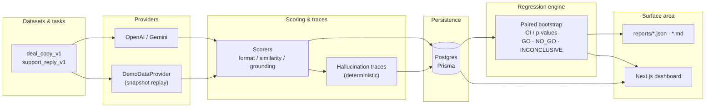
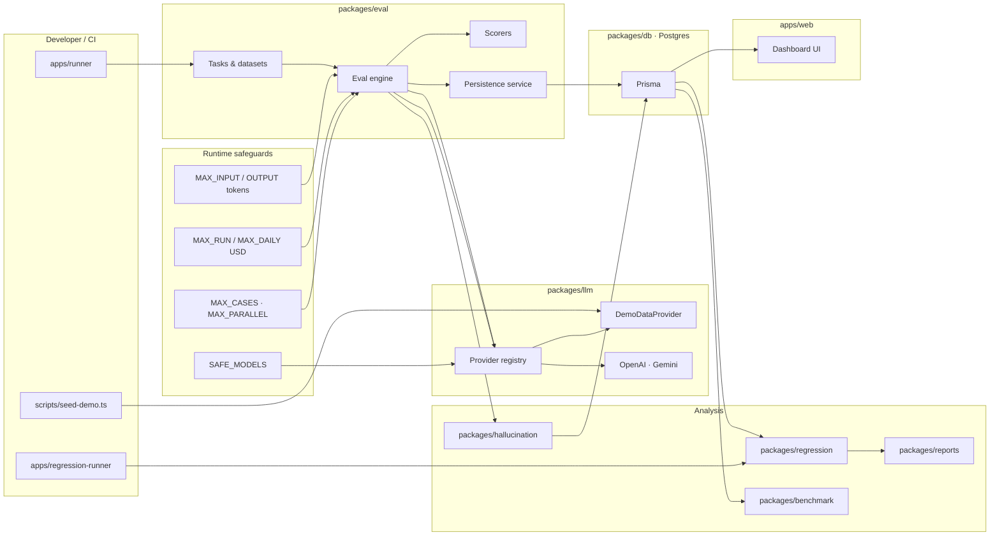

# The Guard — AI Release Safety Platform

Dense operational README for reviewers: what shipped, how it is structured, how to run it safely, and where artifacts live. Submission addenda: [`submission/`](./submission/), eval outputs: [`reports/`](./reports/).

---

## Project Overview

### What was built

**The Guard** is a monorepo for **LLM release safety**: dataset-driven evaluations against OpenAI / Google providers (or deterministic replay), composable scorers, hallucination tracing, statistical regression analysis (paired bootstrap, CIs, p-values), GO/NO-GO/INCONCLUSIVE gating, Markdown/JSON reports for CI, and a **Next.js** ops dashboard (overview, regressions, benchmarks, history).

### Why this assignment was chosen

The problem maps cleanly to **production ML systems work**: shipping prompt/model/orchestration changes without measurable regression discipline is how silent failures reach users. Building **eval + statistics + artifacts + a dashboard** demonstrates systems thinking (boundaries, cost controls, reproducibility) rather than a single-model demo.

### What production problem it solves

Production LLM stacks ship **prompt edits**, **model swaps**, and **scorer changes** with weak gates. Failures are often **silent** until compliance or users surface them: hallucinated numbers, localization drift (e.g. Telugu WhatsApp vs Push), channel compliance violations. The Guard makes those failures **measured**, **explained with evidence**, and **blockable** before rollout.

---

## Architecture Overview

### Monorepo structure

| Path | Role |
|------|------|
| `apps/runner` | Eval CLI: dataset → provider → scorers → persistence. |
| `apps/regression-runner` | Release gate CLI: baseline vs candidate → report JSON/Markdown. |
| `apps/web` | Next.js dashboard (Prisma-backed panels when `DATABASE_URL` is set). |
| `packages/contracts` | Shared types / Zod schemas. |
| `packages/db` | Prisma schema, client wrapper (`@the-guard/db`). |
| `packages/llm` | Provider registry, OpenAI/Gemini, **DemoDataProvider** (snapshot replay), pricing hooks. |
| `packages/eval` | Tasks (`deal_copy_v1`, `support_reply_v1`), engine, scorers, persistence service. |
| `packages/hallucination` | Deterministic claim extraction + verification vs input fields. |
| `packages/regression` | Paired analysis, bootstrap, decision persistence. |
| `packages/benchmark` | Cost vs quality rollups. |
| `packages/reports` | Canonical export helpers for CI artifacts. |

### Request / evaluation lifecycle

1. Runner selects a **task** and **dataset slice** (size capped by env).
2. For each case: build prompt → **TokenGuard** / **ModelPolicyService** / **CostGuard** → `generate()` → parse output.
3. **Scorers** produce per-dimension scores; **hallucination** package may persist traces.
4. Rows land in **Postgres via Prisma** (`eval_runs`, `eval_outputs`, `eval_scores`, `hallucination_traces`, …).

### Release gating flow

1. Two persisted runs (**baseline** vs **candidate**) are compared in the regression package.
2. Statistics: paired deltas, bootstrap **confidence intervals**, **p-values**, segment-aware severity.
3. Decision: **GO**, **NO_GO**, or **INCONCLUSIVE** with reasons and worst examples.
4. Artifacts exported as JSON/Markdown; dashboard surfaces verdicts and traces; CI workflow template under `.github/workflows/`.

---

## Architecture Diagram

### End-to-end data flow (datasets → dashboard)



### Platform diagram (apps + packages + safeguards)



---

## Module Design Decisions & Tradeoffs

### `packages/contracts`

**Why:** Single source of truth for eval case shapes and task metadata across CLI, DB, and UI.  
**Tradeoff:** Extra edits when schemas evolve; gain is compile-time safety and fewer drift bugs.

### `packages/db` (Prisma + Postgres)

**Why:** Normalized storage for runs, scores, traces, regression reports—fits transactional CI/CD and dashboard queries.  
**Why Postgres / Supabase-compatible:** `DATABASE_URL` targets any Postgres; **Supabase** is a common managed host—same connection string pattern.  
**Tradeoff:** Migrations and `prisma generate` in build pipelines; benefit is relational integrity and portable SQL.

### `packages/llm`

**Why:** One `generate()` surface with consistent latency/token/cost metadata and provider errors.  
**Tradeoff:** Thin abstraction vs raw SDKs; keeps runner code readable and testable.

### `packages/eval`

**Why:** Tasks and scorers stay explicit (no magic registry). Datasets live as code for fast iteration; can later move to DB-backed cases.  
**Tradeoff:** Larger repo churn when adding cases; clarity wins for reviewability.

### `packages/hallucination`

**Why:** Deterministic claim checks first—auditable for finance/compliance narratives without depending on an LLM judge in the default path.  
**Tradeoff:** Heuristic patterns miss nuanced claims; structured for extension.

### `packages/regression`

**Why:** Encapsulates statistical methodology and persistence of verdicts for CI and dashboard.  
**Tradeoff:** Bootstrap cost is CPU, not tokens—acceptable for batch gates.

### `packages/benchmark`

**Why:** Operational model selection needs cost/latency/quality tradeoffs in one place.  
**Tradeoff:** Recommendations are only as good as logged metrics.

### `packages/reports`

**Why:** Stable Markdown/JSON shapes for GitHub Actions artifacts and offline review.

### Deterministic replay mode (`ENABLE_DEMO_MODE`)

**Why:** Repeatable demos, CI without API keys, and **zero token spend** during development and recording.  
**Implementation:** `DemoDataProvider` reads [`reports/demo/demo-snapshots.json`](./reports/demo/demo-snapshots.json).

### Dashboard mock fallback

**Why:** `apps/web` can build and render when `DATABASE_URL` is unset (e.g. static hosting); live panels short-circuit with placeholders. With `DATABASE_URL`, Prisma-backed sections show real runs.

---

## Evaluation Methodology

| Stage | Description |
|-------|-------------|
| **Datasets** | Versioned task datasets (`deal_copy_v1`, `support_reply_v1`) with tagged segments (language, channel, policy edge cases). |
| **Scoring** | Composable scorers (e.g. format compliance, semantic similarity, factual grounding); scores persisted per case. |
| **Hallucination tracing** | Claims extracted from outputs; checked against supplied facts/source fields; persisted with confidence + explanation. |
| **Regression analysis** | Paired baseline vs candidate on the **same cases**; mean deltas and segment-aware summaries. |
| **Statistical testing** | Paired **bootstrap** resampling → **95% confidence intervals** for mean deltas and **two-sided p-values** (testing mean(delta) ≠ 0). |
| **Practical significance** | Engineering thresholds supplement raw p-values (documented in package logic); extreme deltas escalate severity. |
| **GO / NO_GO / INCONCLUSIVE** | Decision object combines statistical signals, worst examples, and hallucination/blocker rules; persists for audit. |

---

## Eval Tasks

### `deal_copy_v1`

- **Intent:** Marketing **deal copy** for commerce-style workflows.  
- **Multilingual:** English and **Telugu** (`language: en | te`).  
- **Channels:** **WhatsApp** (longer body) and **Push** (short line; char limits enforced in prompt).  
- **Hallucination-prone cases:** Numeric/discount language, “guaranteed” style claims, date-bound offers—paired with **forbiddenClaims** in inputs.  
- **Formatting edge cases:** Push length caps vs WhatsApp; audience variants (`new_users` / `existing_users`).  
- **Verticals in data:** Fashion, grocery, electronics, travel-style deals (see `packages/eval/src/tasks/dealCopy/dataset.ts`).

### `support_reply_v1`

- **Intent:** Customer **support replies** with policy-aware tone.  
- **Multilingual:** English and Telugu.  
- **Channels:** **chat** vs **email** (different length expectations).  
- **Workflows:** Refunds (eligible / ineligible), **delayed delivery**, **coupon_failure**, damaged item, account issues.  
- **Escalation:** Cases where `escalationRequired` forces handling paths suitable for scorer checks.  
- **Tone edge cases:** neutral vs angry vs abusive customer simulations.

---

## How To Run

**Prerequisites**

- **Node.js** >= **20** (see root `package.json` `engines`).
- **pnpm** via Corepack (repo pins `packageManager`).

```bash
corepack enable
corepack prepare pnpm@10.33.3 --activate
```

### 1. Clone and install

```bash
git clone <YOUR_FORK_OR_REPO_URL> the-guard
cd the-guard
pnpm install
```

### 2. Environment

Copy the example file and edit (never commit secrets):

```bash
cp .env.example .env
```

For **`apps/runner`**, set at minimum `DATABASE_URL` (see [Environment Variables](#environment-variables)). Demo replay avoids API keys.

### 3. Database & Prisma

```bash
pnpm -C packages/db exec prisma migrate dev
pnpm -C packages/db exec prisma generate
```

If your package manager blocks postinstall scripts:

```bash
pnpm approve-builds
pnpm -C packages/db exec prisma generate
```

### 4. Seed deterministic demo data (optional)

```bash
pnpm -w demo:seed
```

### 5. Eval runner (demo replay, no API calls)

```bash
set ENABLE_DEMO_MODE=true
pnpm -C apps/runner dev
```

On Unix:

```bash
ENABLE_DEMO_MODE=true pnpm -C apps/runner dev
```

### 6. Regression runner (demo report from disk)

```bash
pnpm -C apps/regression-runner dev -- --baseline demo-baseline --candidate demo-candidate --markdown reports/tmp/regression.md --json reports/tmp/regression.json
```

(`reports/tmp/` is gitignored.) With `ENABLE_DEMO_MODE=true`, output reflects [`reports/demo/demo-regression-report.json`](./reports/demo/demo-regression-report.json).

### 7. Web dashboard

```bash
pnpm -C packages/db exec prisma generate
pnpm -C apps/web build
pnpm -C apps/web dev
```

Open `http://localhost:3000`. Set `DATABASE_URL` in `apps/web/.env.local` for live Prisma panels.

### 8. Validation (submission checks)

```bash
pnpm -w typecheck
pnpm -C apps/web build
```

---

## Environment Variables

Documented below for **`apps/runner`** (Zod-validated in `apps/runner/src/env.ts`) unless noted.

| Variable | Purpose |
|----------|---------|
| `DATABASE_URL` | Postgres connection string for Prisma. **Required** for runner persistence and for live dashboard reads. |
| `ENABLE_DEMO_MODE` | `true` → use **snapshot replay** (`DemoDataProvider`); no live provider calls. Keeps demos and CI deterministic. |
| `DEMO_SNAPSHOT_PATH` | JSON snapshot for demo mode (default relative to runner: `../../reports/demo/demo-snapshots.json`). |
| `SAFE_MODELS` | Comma-separated **allowlist** of model ids permitted through policy checks. Prevents accidental calls to unreviewed models in shared environments. |
| `MAX_RUN_COST_USD` | Hard ceiling for **estimated** cost per run; abort telemetry when exceeded. |
| `MAX_DAILY_COST_USD` | Aggregate daily ceiling for cost guardrails in shared keys / CI. |
| `MAX_CASES_PER_RUN` | Caps dataset slice size for runner (default `10`)—limits spend and wall time. |
| `MAX_PARALLEL_EVALS` | Concurrency cap—reduces burst rate on provider TPM/RPM and DB write pressure. |
| `MAX_INPUT_TOKENS` | Truncation bound on composed prompts before provider call. |
| `MAX_OUTPUT_TOKENS` | Passed through as generation cap (`maxOutputTokens`). |
| `THE_GUARD_MAX_RETRIES` | Provider retry budget (often **`0` in demo mode** to fail fast and avoid duplicate spend). |
| `THE_GUARD_PROVIDER` | `openai` \| `google`. |
| `THE_GUARD_MODEL` | Model id string (must align with `SAFE_MODELS` when policy enforced). |
| `OPENAI_API_KEY` / `GEMINI_API_KEY` | Required for **live** calls; omit in demo replay. |
| `THE_GUARD_TIMEOUT_MS` | Request timeout. |
| `ENABLE_BENCHMARK_SWEEPS` | `true` enables sweep-style benchmark paths in tooling (default off—guards against accidental multi-model spend). |

**`apps/regression-runner`** (`apps/regression-runner/src/env.ts`):

| Variable | Purpose |
|----------|---------|
| `ENABLE_DEMO_MODE` | When `true`, reads `DEMO_REGRESSION_REPORT_PATH` instead of DB analysis. |
| `DEMO_REGRESSION_REPORT_PATH` | Default `../../reports/demo/demo-regression-report.json` from package cwd. |

See [`.env.example`](./.env.example) for copy-paste templates.

---

## Eval Results

Representative metrics from **checked-in demo snapshots** ([`reports/demo/demo-snapshots.json`](./reports/demo/demo-snapshots.json)). Costs are **estimated** from internal pricing metadata (`isEstimated: true`); latencies are **synthetic** for replay (`demo: true`).

| Metric (per snapshot entry) | Example value | Notes |
|-----------------------------|---------------|--------|
| Reported latency | ~**120 ms** | Deterministic replay stand-in, not live wall time. |
| Total tokens (sample) | **133–135** | Varies by prompt length (EN/te, WhatsApp vs push). |
| Estimated USD / call | ~**$0.00029** | e.g. totalCost `0.000288` for `gpt-4o-mini`-style pricing metadata. |
| Hallucination detections | Case-specific | Live runs persist rows in `hallucination_traces`; dashboard renders traces when DB populated. |
| Regression verdict (demo JSON) | **GO** | [`demo-regression-report.json`](./reports/demo/demo-regression-report.json); reasons note deterministic demo seed. |

**Live runs:** With real providers and DB, pass rates and blocker counts derive from persisted `eval_scores` and regression analysis—use the dashboard and exported reports for those sessions.

---

## Cost Analysis

| Category | Order-of-magnitude | Notes |
|----------|---------------------|--------|
| **Engineering time** | Single-digit person-weeks for core monorepo + dashboard + gates | Includes iteration on scoring, stats, and demo reliability—not billed as API usage. |
| **Single eval run (live)** | **≤ `$MAX_RUN_COST_USD`** (default **$1.00**) before hard guard | Actual spend depends on model, cases run, and token lengths; demo replay ≈ **$0**. |
| **Regression analysis** | Primarily **CPU** + DB reads | No mandatory extra provider calls beyond the two runs being compared. |
| **Deterministic replay** | **$0** token cost | Recorded snapshots power Loom demos and CI without burning keys. |

Replay mode intentionally avoided repeated OpenAI/Google calls during iteration, demo recording, and reviewer dry runs—this is the dominant cost control during development.

---

## What Broke First

| Issue | What happened | Mitigation |
|-------|----------------|------------|
| **Turbopack + monorepo root** | With Vercel **Root Directory = `apps/web`**, Turbopack treated only `apps/web` as resolvable scope and failed on `@the-guard/db`. | Set `turbopack.root` + `outputFileTracingRoot` to monorepo root in `apps/web/next.config.ts`; build `@the-guard/db` before `next build`. |
| **`@the-guard/db` compile order** | Package exports `./dist/index.js`; clean CI had no `dist` until `tsc` ran. | Runner build script builds DB first; `prisma generate` in db package for skipped postinstall. |
| **Prisma on restricted installs** | Some environments ignore Prisma `postinstall`. | Document `pnpm approve-builds` + explicit `prisma generate` in db build. |
| **Nested / stray git state** | Nested `.git` breaks submodules and reviewer clones. | Verified single root `.git`; no nested repos committed. |
| **Mock vs live hybrid** | Dashboard must render without DB for static builds; with DB must show live rows. | Explicit `DATABASE_URL` checks in server components; deterministic panels remain for demos. |
| **`turbo.json` validity** | Duplicate JSON objects in `turbo.json` broke tooling parsers (e.g. `JSON5` errors). | Merged to a single valid `turbo.json`. |

---

## What I Would Change With 2 More Weeks

- **Async job queues** for long runs (SQS / Cloud Tasks) with idempotent run ids.  
- **Deeper CI integration**: matrixed providers, artifact signing, baseline pinning per branch.  
- **Canary rollout support**: shadow-traffic sampling hooks (safe, redacted).  
- **Distributed eval execution**: shard cases across workers with shared progress in Postgres.  
- **Streaming traces**: SSE/WebSocket for runner progress and partial scorer results.  
- **Benchmark orchestration**: scheduled sweeps with budget envelopes across models.  
- **Provider failover**: circuit breaker + secondary provider routing with explicit policy.  
- **RBAC / auth** on dashboard and report APIs.  
- **Alerting**: PagerDuty/Slack on NO_GO or cost guard breaches.

---

## Deployment Notes

- **Local-first:** Primary workflows assume Postgres + CLI on a developer machine or CI runner.  
- **Vercel (optional):** `apps/web` can deploy as a Next.js app with **Root Directory** `apps/web`; monorepo install from parent; `@the-guard/db` must be built before `next build`. Database required for live panels.  
- **Runners:** `apps/runner` and `apps/regression-runner` are intended for **batch/CI** execution more than serverless long-running jobs without a queue.  
- **Deterministic replay:** Used for reliable demos and zero-cost dry runs (`ENABLE_DEMO_MODE=true`).

---

## Future Work

- Shadow evaluations on sampled production traffic (redaction + consent).  
- Drift detection by segment over time.  
- Human review workflow for **INCONCLUSIVE** borderline cases.  
- Gold-reference management and annotator tooling.  
- Richer prompt lineage (multi-parent merges, progressive rollouts).  
- Segment-specific thresholds by task criticality.

---

## Screenshots

Checked-in captures (dark UI):

| Area | File |
|------|------|
| Release overview (eval runs + verdict) | [`docs/screenshots/s1.png`](./docs/screenshots/s1.png) |
| Regression detail (falling examples) | [`docs/screenshots/s2.png`](./docs/screenshots/s2.png) |
| History / timeline / trends | [`docs/screenshots/s3.png`](./docs/screenshots/s3.png) |
| Hallucination evidence / traces | [`docs/screenshots/s4.png`](./docs/screenshots/s4.png) |

Placeholder filenames for optional extra captures (see [`docs/screenshots/README.md`](./docs/screenshots/README.md)): `release-overview.png`, `regression-detail.png`, `hallucination-traces.png`, `benchmark-dashboard.png`, `timeline-view.png`.


---

## Submission materials

Index: [`submission/README.md`](./submission/README.md)

- [`submission/final-report.md`](./submission/final-report.md) — executive engineering summary.  
- [`submission/architecture-summary.md`](./submission/architecture-summary.md) — condensed architecture.  
- [`submission/cost-analysis.md`](./submission/cost-analysis.md) — provider usage estimates.  
- [`submission/demo-links.md`](./submission/demo-links.md) — repo, Loom, screenshot index.

---

## License

See [`LICENSE`](./LICENSE) (MIT).
